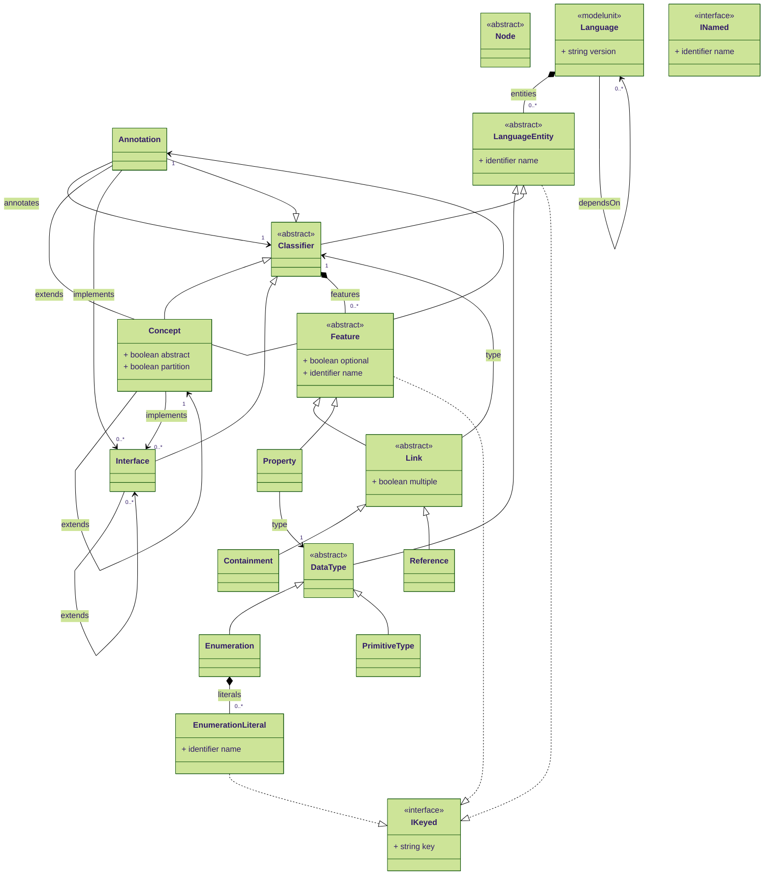

# Class diagram for language LionCore_M3

```mermaid
    %%{init: {'theme': 'forest'} }%%
    classDiagram
    direction TD
    %% other possibilites: LR RL DT TB (same as TD)
    class Node {
        <<abstract>>
        
    }
    class Annotation {
        
        
    }
    class Concept {
        
        + boolean abstract
		+ boolean partition
    }
    class Interface {
        
        
    }
    class Containment {
        
        
    }
    class DataType {
        <<abstract>>
        
    }
    class Enumeration {
        
        
    }
    class EnumerationLiteral {
        
        + identifier name
    }
    class Feature {
        <<abstract>>
        + boolean optional
		+ identifier name
    }
    class Classifier {
        <<abstract>>
        
    }
    class Link {
        <<abstract>>
        + boolean multiple
    }
    class LanguageEntity {
        <<abstract>>
        + identifier name
    }
    class PrimitiveType {
        
        
    }
    class Property {
        
        
    }
    class Reference {
        
        
    }
    class Language {
        <<modelunit>>
        + string version
    }
    class INamed {
        <<interface>>
        + identifier name
    }
    class IKeyed {
        <<interface>>
        + string key
    }
    Language *-- "0..*" LanguageEntity : entities

        Language --> "0..*" Language : dependsOn

    Classifier <|-- Annotation
Classifier <|-- Concept
Classifier <|-- Interface
Link <|-- Containment
LanguageEntity <|-- DataType
DataType <|-- Enumeration
LanguageEntity <|-- Classifier
Feature <|-- Link
DataType <|-- PrimitiveType
Feature <|-- Property
Link <|-- Reference

        Enumeration *-- "0..*" EnumerationLiteral : literals
Classifier *-- "0..*" Feature : features

        Annotation --> "1" Classifier : annotates

		Annotation --> "1" Annotation : extends

		Annotation --> "0..*" Interface : implements
Concept --> "1" Concept : extends

		Concept --> "0..*" Interface : implements
Interface --> "0..*" Interface : extends
Link --> "1" Classifier : type
Property --> "1" DataType : type

        EnumerationLiteral ..|> IKeyed
Feature ..|> IKeyed
LanguageEntity ..|> IKeyed

```
