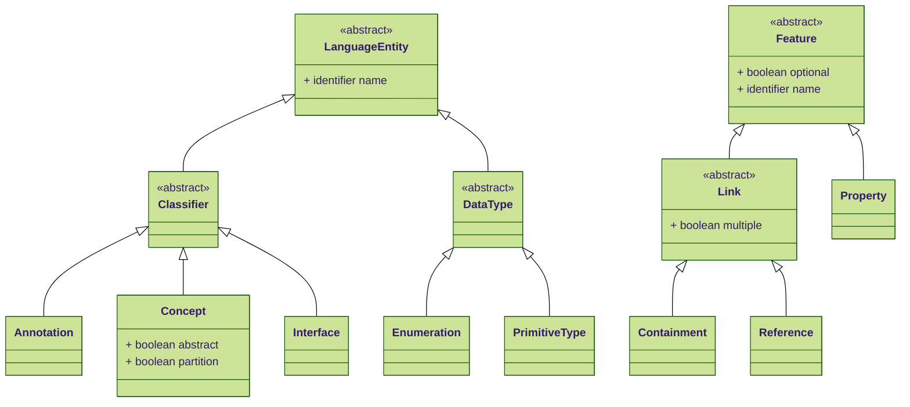

# Inheritance diagram for language LionCore_M3

```mermaid
    %%{init: {'theme': 'forest'} }%%
    classDiagram
    direction TD
    %% other possibilites: LR RL DT TB (same as TD)
    class Annotation {
        
        
    }
    class Classifier {
        <<abstract>>
        
    }
    class Concept {
        
        + boolean abstract
		+ boolean partition
    }
    class Interface {
        
        
    }
    class Containment {
        
        
    }
    class Link {
        <<abstract>>
        + boolean multiple
    }
    class DataType {
        <<abstract>>
        
    }
    class LanguageEntity {
        <<abstract>>
        + identifier name
    }
    class Enumeration {
        
        
    }
    class Feature {
        <<abstract>>
        + boolean optional
		+ identifier name
    }
    class PrimitiveType {
        
        
    }
    class Property {
        
        
    }
    class Reference {
        
        
    }
    Classifier <|-- Annotation
LanguageEntity <|-- Classifier
Classifier <|-- Concept
Classifier <|-- Interface
Link <|-- Containment
Feature <|-- Link
LanguageEntity <|-- DataType
DataType <|-- Enumeration
DataType <|-- PrimitiveType
Feature <|-- Property
Link <|-- Reference

```
