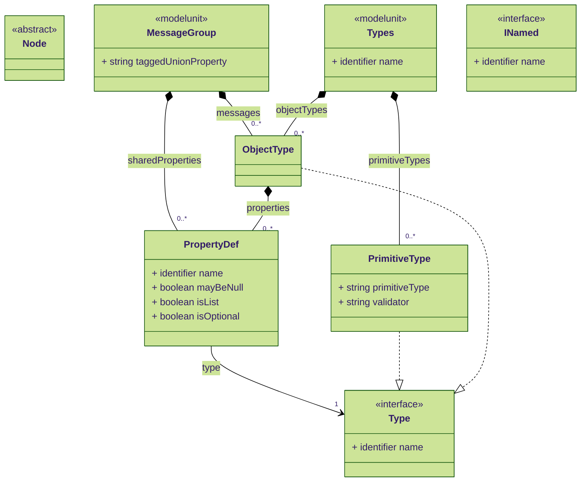

# Class diagram for language Protocol

```mermaid
    %%{init: {'theme': 'forest'} }%%
    classDiagram
    direction TD
    %% other possibilites: LR RL DT TB (same as TD)
    class Node {
        <<abstract>>
        
    }
    class PropertyDef {
        
        + identifier name
		+ boolean mayBeNull
		+ boolean isList
		+ boolean isOptional
    }
    class PrimitiveType {
        
        + string primitiveType
		+ string validator
    }
    class ObjectType {
        
        
    }
    class MessageGroup {
        <<modelunit>>
        + string taggedUnionProperty
    }
    class Types {
        <<modelunit>>
        + identifier name
    }
    class INamed {
        <<interface>>
        + identifier name
    }
    class Type {
        <<interface>>
        + identifier name
    }
    MessageGroup *-- "0..*" PropertyDef : sharedProperties

		MessageGroup *-- "0..*" ObjectType : messages
Types *-- "0..*" PrimitiveType : primitiveTypes

		Types *-- "0..*" ObjectType : objectTypes

        
    
        ObjectType *-- "0..*" PropertyDef : properties

        PropertyDef --> "1" Type : type

        PrimitiveType ..|> Type
ObjectType ..|> Type

```
