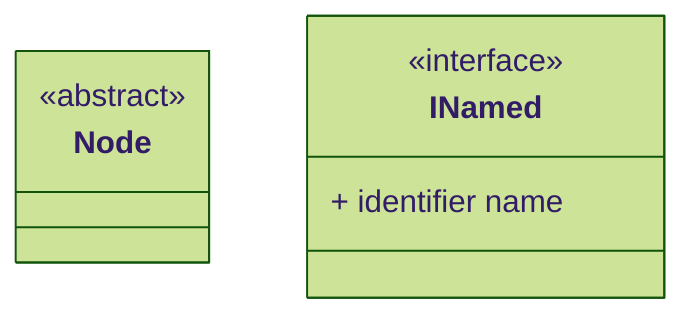

# Class diagram for file LionCore_builtins

```mermaid
    %%{init: {'theme': 'forest'} }%%
    classDiagram
    direction TD
    %% other possibilites: LR RL DT TB (same as TD)
    class Node {
        <<abstract>>
        
    }
    class INamed {
        <<interface>>
        + identifier name
    }
    
        
        
        
```
