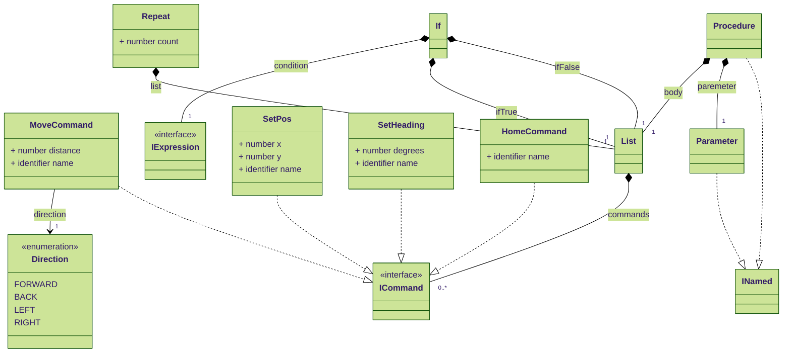

# Class diagram for file LogoProgram

```mermaid
    %%{init: {'theme': 'forest'} }%%
    classDiagram
    direction TD
    %% other possibilites: LR RL DT TB (same as TD)
    class MoveCommand {
        
        + number distance
		+ identifier name
    }
    class List {
        
        
    }
    class SetPos {
        
        + number x
		+ number y
		+ identifier name
    }
    class SetHeading {
        
        + number degrees
		+ identifier name
    }
    class HomeCommand {
        
        + identifier name
    }
    class Repeat {
        
        + number count
    }
    class If {
        
        
    }
    class Procedure {
        
        
    }
    class Parameter {
        
        
    }
    class Direction {
        <<enumeration>>
        FORWARD
		BACK
		LEFT
		RIGHT
    }
    class ICommand {
        <<interface>>
        
    }
    class IExpression {
        <<interface>>
        
    }
    
        List *-- "0..*" ICommand : commands
Repeat *-- "1" List : list
If *-- "1" IExpression : condition

		If *-- "1" List : ifTrue

		If *-- "1" List : ifFalse
Procedure *-- "1" List : body

		Procedure *-- "1" Parameter : paremeter

        MoveCommand --> "1" Direction : direction

        MoveCommand ..|> ICommand
SetPos ..|> ICommand
SetHeading ..|> ICommand
HomeCommand ..|> ICommand
Procedure ..|> INamed
Parameter ..|> INamed

```
